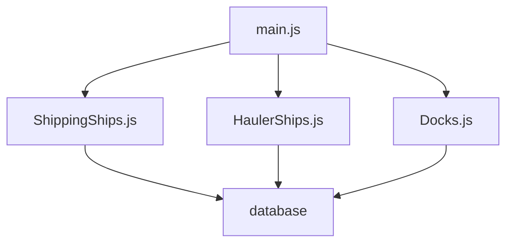
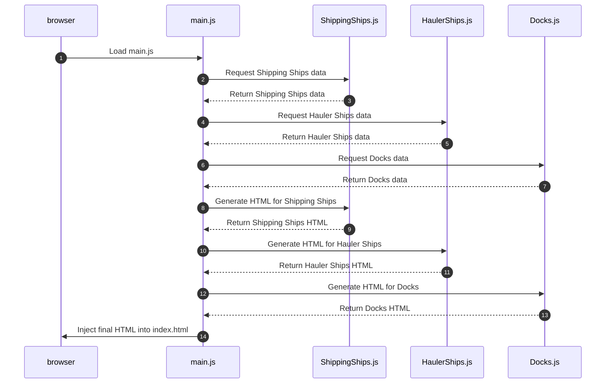

# Diagrams

## Dependency Graph

```mermaid
graph TD
    main.js --> ShippingShips.js
    main.js --> HaulerShips.js
    main.js --> Docks.js
    ShippingShips.js --> database
    HaulerShips.js --> database
    Docks.js --> database

```
## Sequence Diagram

```mermaid
sequenceDiagram
    autonumber
    browser->>main.js: Load main.js
    main.js->>ShippingShips.js: Request Shipping Ships data
    ShippingShips.js-->>main.js: Return Shipping Ships data
    main.js->>HaulerShips.js: Request Hauler Ships data
    HaulerShips.js-->>main.js: Return Hauler Ships data
    main.js->>Docks.js: Request Docks data
    Docks.js-->>main.js: Return Docks data
    main.js->>ShippingShips.js: Generate HTML for Shipping Ships
    ShippingShips.js-->>main.js: Return Shipping Ships HTML
    main.js->>HaulerShips.js: Generate HTML for Hauler Ships
    HaulerShips.js-->>main.js: Return Hauler Ships HTML
    main.js->>Docks.js: Generate HTML for Docks
    Docks.js-->>main.js: Return Docks HTML
    main.js->>browser: Inject final HTML into index.html

```